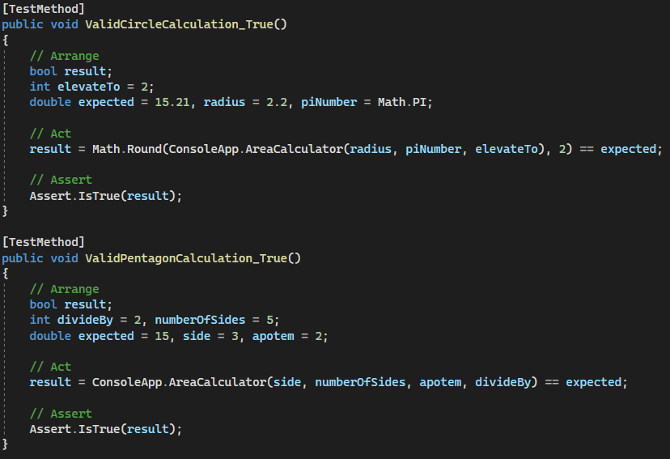
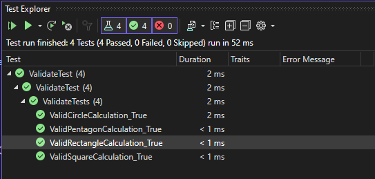

# DOCUMENTACIÓN EJERCICIO 23

## CREACIÓN DEL REPOSITORIO
- Primero he creado el repositorio en Github, y luego lo he clonado en mi ordenador:

- Clonación:

---

## PRUEBA DE PERMISOS PARA HACER PUSH
- Para la prueba del push, he creado un documento .txt vacío y he probado de hacer git add, git commit y git push para actualizar el repositorio local al repositorio remoto:

- Y ahora, hago todos los comandos de git para verificar que tengo permisos:

- Como estamos en un ordenador compartido, no es lo ideal crear un usuario global en github, por eso como no existe me pide crear un nuevo usuario para poder hacer el commit y lo creo de manera local sólo para este repositorio.

---

## CREACIÓN DEL PROYECTO Y DE LAS TAREAS
- Primero, hemos de crear un proyecto nuevo para este repositorio. Nos vamos al apartado de projects, y le damos a 'New project'.

- Después, nos pide que tipo de proyecto queremos crear, la vista que va a tener de manera visual. Elegimos el board, y después le damos un nombre:

- Una vez creado, podemos añadir varias tareas en el proyecto:

- Y cuando empecemos a trabajar en una tarea en concreto, la movemos a 'In Progress':

---

## CREACIÓN DEL SCRIPT Y CÓDIGO INICIAL

### Primera tarea: Creación variables y mensajes generales
- Asi quedaría el código del programa principal sólo con el código del método Main:

- Una vez terminada la primera tarea, hacemos el commit y push para crear una pull request. Después, en el github podemos aceptar la pull request una vez compruebe que todo está correcto y después se nos habrá actualizado el projects automáticamente si hemos indicado 'closes #X' en el mensaje del commit donde 'x' es el número de la tarea acabada.

- Y creamos una nueva branch para la siguiente tarea:

### Segunda tarea: Métodos para calcular cada área con sobrecarga
- Este es el código de los métodos con sobrecarga para cada figura:

- Este es el mensaje del commit para cerrar la segunda tarea del project:

- Y después verificamos el pull request que se crea al hacer el push después del commit:

- También se nos habrá actualizado la tarea del projects automáticamente:

- Y asi sucesivamente con todos las tareas relativas al código principal del programa.

## UNIT TESTING

### Script del unit testing con métodos del script principal

#### Test del cuadrado y del rectángulo:

#### Test del círculo y del pentágono:

- Y con esto ya tendríamos el ejercicio acabado y los unit test funcionando de manera correcta:

